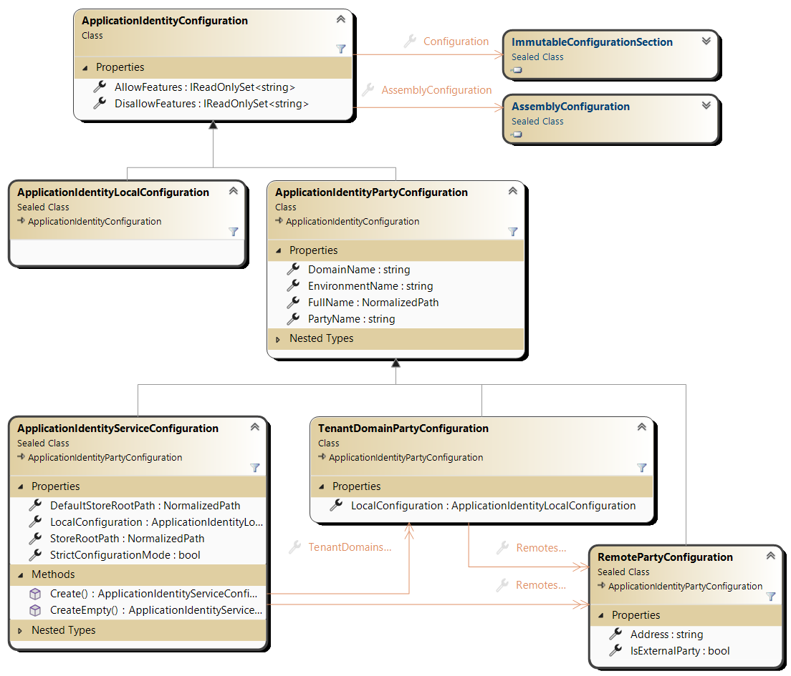

# Application identity model configuration

The goal of this configuration is to be the single central point of configuration for an application (called a Party)
and its peers (its Parties) and to "carry" all the communication and interaction services with its parties:
- It is as simple as possible to configure.
- Once initially configured, no configuration change is possible during the execution **for what has been configured**.
- Dynamic parties are supported (these are the non initially configured beasts).

The simplest way to introduce configurations is to show some examples that introduce the basic concepts
of CK.AppIdentity.

> One should be able to understand the role of an application and its interactions with the external world
by looking at its configuration.


## Configuration samples

### The simplest one
An application identity is a triple: DomainName, PartyName, EnvironementName that are strictly defined
(see [CK.Core.CoreApplicationIdentity](https://github.com/Invenietis/CK-Core/tree/develop/CK.Core/CoreApplicationIdentity)). The simplest valid configuration is an application without any parties:
```json
{
  "FullName": "AcmeCorp/$Trolley1/#Production"
}
```
This is a functional but lonely application. Dynamic parties can then be added to it at runtime and
subsequently destroyed.

In the following examples, Parties are defined statically, in the initial configuration: these are not dynamic
parties and cannot be destroyed.

### Standard ones
A simple application that interacts with 2 remote parties: 
```json
{
  "FullName": "AcmeCorp/$Trolley1/#Production",
  "Parties": [
   {
    "DomainName": "CentralHealth/Clients",
    "PartyName": "LogTower",
    "Address": "148.54.11.18:3712"
   },
   {
     "PartyName": "$SigBox",
     "Address": "155.88.22.22"
   }]
}
```
There should be no more than that: Trolley1 sends its logs to a LogTower and can initiate communications
(see below) with the SigBox.

The LogTower is not in the AcmeCorp domain but in the "CentralHealth/Clients" domain. The above example uses
the explicit properties "DomainName" and "PartyName". We could have used the
`"FullName": "CentralHealth/Clients/$LogTower"` here.

The SigBox also sends its logs to the same LogTower and knows the Trolley1 but also the Trolley2 and the PickingStation.
```json
{
  "FullName": "AcmeCorp/$SigBox/#Production",
  "Parties": [
  {
    "FullName": "CentralHealth/Clients/$LogTower",
    "Address": "148.54.11.18:3712"
  },
  {
    "PartyName": "Trolley1"
  },
  {
    "PartyName": "Trolley2"
  },
  {
    "PartyName": "PickingStation"
  }]
}
```
These 3 remotes have no Addresses: "AcmeCorp/$SigBox/#Production" is a server for these parties
and this is enough for the SigBox, 2 trolleys and one picking station to work together.

Now we want the SigBox to interact with a OneCS application (the supervision and operation portal).
The OneCS application typically lives in the cloud. If the SigBox can be reached from the outside,
we just need to declare the new OneCS remote on the SigBox.

_Notes:_
- From now on, we don't show the LogTower configuration. This is the same for every party
  (if we want to target the same LogTower).
- We also don’t specify the EnvironementName anymore. This defaults to the IHostEnvironment.EnvironementName
  (that defaults to "#Dev")

The name of this new Party is the same as the DomainName: **"AcmeCorp/$AcmeCorp"**.

When the PartyName is the same as the last segment of the Domain path, this Party conventionally designates the
"domain controller" which is the "default application" (we can call it "$Portal" or "$Root" or "$Main", etc.).
For example, the international customer BigCorp may have a root application (the world-wide portal) "BigCorp/$BigCorp"
and multiple country-specific applications "BigCorp/FR/$FR", "BigCorp/EN/$EN", etc.

This convention is simple and allows such "controllers" to be designated in a complex architecture. This is a
convention until one need to handle multi-tenancy: a **TenantDomain** That will be presented next follow
this convention (and have no Address).

```json
{
  "FullName": "AcmeCorp/$SigBox",
  "Parties": [
  {
    "PartyName": "$Trolley1"
  },
  {
    "PartyName": "$Trolley2"
  },
  {
    "PartyName": "$PickingStation"
  },
  {
    "PartyName": "$AcmeCorp"
  }]
}
```
Below is the OneCS configuration:
```json
{
  "FullName": "AcmeCorp/$AcmeCorp"
  "Parties": [
  {
    "PartyName": "$SigBox",
    "Address": "65.12.13.14"
  }]
}
```
If, for any reason, the SigBox cannot be reached from the outside (typically because of a firewall), we simply
change the place where the Address is defined. By moving the Address from the OneCS configuration to the SigBox,
the box becomes the initiator (the Client) and OneCS becomes a listener (a Server) for the box.

The configurations become:
```json
{
  "FullName": "AcmeCorp/$AcmeCorp"
  "Parties": [
  {
    "PartyName": "$SigBox",
  }]
}
```
And:
```json
{
  "FullName": "AcmeCorp/$SigBox",
  "Parties": [
  {
    "PartyName": "$Trolley1"
  },
  {
    "PartyName": "$Trolley2"
  },
  {
    "PartyName": "$PickingStation"
  },
  {
    "PartyName": "$AcmeCorp",
    "Address": "27.28.29.30"
  }]
}
```

### Multi-tenancy support: the TenantDomain configuration

A **Tenant** is a subset of bigger system logically tied to some human concept like an organization or a "group
or resources" for which data specific to the Tenant must be handled potentially by code specific to that Tenant.

A multi-tenant application hosts one or more Tenants, each being logically disjointed from the others. The Application
identity models supports such Tenants definition through the **TenantDomain** concept. A TenantDomain is a Party
of an application (just like a Remote Party is) but it is a Party that contains other Parties. Defining a **TenantDomain**
is straightforward:
- Its name follow the "controller domain" convention (its full name is like "BigCorp/$BigCorp" or "BigCorp/EN/$EN").
- It has no Address:
  - It can be somehow "virtual": no one will call it, it has no intrinsic capability;
  - Or it can play an active part in the "domain it controls" and then it is necessarily a Server for its Remote Parties.

The important point to understand here is that this structure is not recursive; it's not a tree structure. A Tenant
is a simple group with a list of Remote Parties. Usually its Remote Parties have the same Domain as the Tenant's one, or
are in a sub domain of the Tenant's Domain but this is not mandatory.

The simplest TenantDomain definition is:
```json
{
  "FullName": "AcmeCorp/$AcmeCorp"
}
```
It is initially empty but dynamic remotes can be programatically added to it.

Because each Tenant has its own dedicated configuration space, it can contain configuration keys that can apply (by
"inheritance") to its Remotes (and only to its Remotes).

### The Local configuration(s)

One subtlety concerns the modeling of the notion of local application.
From a hierarchical point of view, it seems logical to configure the host application in the
configuration root:
```jsonc
{
  "FullName": "Test/$App",
  // This is where application-specific configurations MAY appear... but NO!
  "Parties": [
   {
     "PartyName": "$Box",
   }]
}
```
However, one of the principles underlying the handling of these configurations is "inheritance": keys from
a higher level can be applied "below". This inheritance factorizes information and secures the system (some
components introduce the possibility of locking or limiting critical configurations, enabling dynamic sub-configuration
"imports" to be accepted without risk). This is why there is a "Local" configuration section:

```jsonc
{
  "FullName": "Test/$App",
  // Configurations that apply globally to the application (typically default values)
  // can be entered here.
  "Local": {
     // This is where the local application can be configured.
  }, 
  "Parties": [
   {
     "PartyName": "$Box",
   }]
}
```

In a multi-tenant configuration, each Tenant has its "Local": this can be used to configure
components and plugins specific to that Tenant:

```jsonc
{
  "FullName": "Test/$SaaSApp",
  "Local": {
     // This is where the local application can be configured.
  }, 
  "Parties": [
   {
     "FullName": "Tenant1/$Tenant1",
     "Local": {
        // Here comes the local configuration of Tenant1.
     }, 
     "Parties": [
      {
        "PartyName": "$Box"
        "Address": "126.87.1.1:4040"
      }]
   }]
}
```

Here too, inheritance applies: the configuration keys in the definition of the Tenant itself apply
to the entire section and its sub-sections.

Inheritance is actually "generalized": Tenant can have recursive Parties (think "groups"): this
allows parts of a Tenant that share certain configuration aspects to be grouped together and these
common configurations to be factored into a parent node.

When the sections are analyzed, recursive "Parties" sections are traversed and all "RemoteParty"
are "flattened": the hierarchy applies only to configuration and key factorization/propagation,
not to the structure of a Tenant itself: a Tenant is and remains a simple list of Remote Parties.

The above examples are in JSON. The actual configuration is provided by the .NET abstraction
[IConfigurationSection](https://learn.microsoft.com/fr-fr/dotnet/api/microsoft.extensions.configuration.iconfigurationsection)
that can originate from multiple configuration providers.

## Mutable and immutable IConfigurationSection helpers (from CK.Configuration).

To manage this lower level of configuration (and guaranty its immutability), we use [CK.Configuration](https://github.com/signature-opensource/CK-Configuration/blob/master/CK.Configuration/README.md).

A `ImmutableConfigurationSection` is a `IConfigurationSection` that captures once for all the content and path of any other `IConfigurationSection`.

Each application identity objects is bound and exposes its immutable configuration section.

The `MutableConfigurationSection` acts as a builder for immutable configuration and hence is used to
initialize dynamic parties.


### Strictly checking the configuration (or not)

A `StrictConfigurationMode` boolean property drives whether warnings must be considered as errors.
This defaults to false only when environment name is "#Dev" (the default, non configured environment
name) but can always be explicitly configured at the root configuration level.

The goal is to be strict but some configuration may emit annoying warnings. When this happens,
the global approach is to temporarily set the `StrictConfigurationMode` to false and to consider
those annoying warning as "bugs" that must be fixed by emitting an Info instead of a Warn. Once done,
strict mode can be set back to true.


### The Configuration model
A `ImmutableConfigurationSection` successfully analyzed results in muliple objects described below:



This model shows the 3 main types of identity objects:
- **ApplicationIdentity** is the root object.
- It holds a collection of **TenantDomains** and a collection of **Remotes**.
- A **TenantDomain** also holds a collection of **Remotes**.
- All configurations are issued and expose their `ImmutableConfigurationSection` configuration and
  a `AssemblyConfiguration` that captures possible "plugins/dynamic extension" assemblies.

Based on these configuration objects, the ["runtime" model](../Model/README.md) is initialized.


