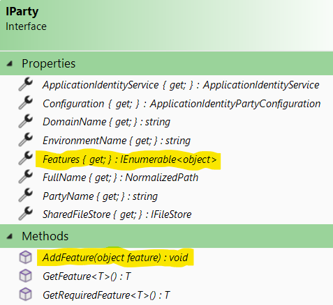
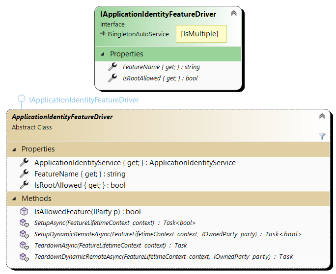

# The Features

If the ["run time" model](../Model/README.md) is a skeleton, the Features are the muscles.

Features are not typed: they are objects that can be very simple or very complex, and which decorate
each Party. From the outside, the API is trivial:



Features can only be added, not removed. 

## The Package First approach

In practice, we don't use this `AddFeature` method directly, as the addition and initialization of the Features that decorate each Party is
carried out automatically by the Feature drivers, which are automatic singleton services: simply installing the Feature's NuGet package
makes it operational (this is the "Package First" approach). To facilitate development, a Template Method is available, which you simply
need to specialize.

A driver is responsible for:
- Creating, initializing and adding any Features it wishes to the system's initial Parties (by implementing the `SetupAsync` method);
- Doing the same for any dynamic Parties that appear (by implementing the `SetupDynamicRemoteAsync` method);
- doing whatever is necessary when a dynamic Party is deleted (by implementing the `TeardownDynamicRemoteAsync` method);
- and finally, doing whatever is necessary when the entire Service is deleted, which in practice corresponds to a host application
  shutdown (by implementing the `TeardownAsync` method).

These functions are called by the micro agent ([AppIdentityAgent](../AppIdentityAgent.cs)) which manages the lifecycle of Parties and
Features.



A Feature can be opt-in or opt-out. The implementation expresses this via the constructor of the abstract class:
```csharp
protected ApplicationIdentityFeatureDriver( ApplicationIdentityService s, bool isAllowedByDefault )
```

Configuration then takes over via "Allow/DisallowFeatures", which control the final list of associated features for each Party:

- The feature name is deduced from the driver type: a `XXXFeatureDriver` manages the "*XXX*" feature. It is this name that is
  used in the configuration.
- The driver implementation can then use the `bool IsAllowedFeature( IParty p )` helper method, which will give it the final result of the
  Allow/Disallow configurations for the given Party according to the configuration sections (up to the configuration root).
- Setup methods can fail. Rather than throwing an exception, they are prompted to issue error logs and simply return false (but if they
  throw, this is of course handled). 
- Teardown methods are not expected to fail. 

The order in which driver methods are called respects the dependencies between drivers: if the driver in Feature "A" depends on
Feature "B", then :

- `SetupAsync` and `SetupDynamicRemoteAsync` of "A" will be called after the setup methods of "B" have been called.
- The Teardowns are reversed: "B" will only be called upon after "A" has done its cleaning job. 

## Feature configuration

CK.AppIdentity only needs two configuration keys to manage Features: "AllowFeatures" and "DisallowFeatures". Their value can be a string,
a string containing comma-separated substrings, or an array of strings. Their contents are combined in the configuration tree during
initialization to establish a list of **possible** and **forbidden** Features at any Party level. The opt-in/opt-out function intrinsic
to each FeatureDriver (described above) then takes over to establish the final list of Features for a Party.

Thanks to the topological ordering of the FeatureDrivers (described above), a Driver can decide whether a Feature is available
depending on the status of another Feature (absence, presence, or even some of its configurations). 

For example, the TransportFeature (from CK.AppIdentity.Transport) requires a RemoteKeyFeature (from CK.AppIdentity.KeyManagement) to be
available on a party: if this is not the case, the TransportFeatureDriver issues a warning:
*"Remote 'AcmeCorp/$Server' cannot support the allowed 'Transport' feature because the remote has a disallowed 'KeyManagement' feature."*.

Drivers have access to all configuration sections. They are free to consider certain keys in parent sections (to implement configuration
inheritance) or to ignore them altogether, taking into account only configurations directly expressed on the Party they are analyzing. 

These different strategies are important. Some configuration keys should not be inherited (anything to do with security, for example,
should not be inheritable), while others should be, to facilitate system configuration.

__Important:__ There is no namespace or other partitioning of names/keys: drivers who don't know each other can perfectly well use
common keys... or should but don't. We didn't consider this to be an issue at this stage, and even saw it as a
strength of the system: the same configuration key can therefore impact several Features "naturally". 

## The ServiceLocator anti-pattern?

Remotes carry the object-features. To find them, you have to go looking for them.
This is definitely closer to [Service Locator](https://en.wikipedia.org/wiki/Service_locator_pattern) than to
dependency injection. But how else can you do it? One possibility is to use "indirection keys" in the
DI container. All too often, these "contexts" or other "ServiceKeys" lead to a nightmare in terms of
maintainability. We don't want to use them, we've banned them from our designs because they lead to
far too much accidental complexity.

To solve the problem elegantly, all you have to do is take the time to create services (singletons or scoped)
that will manage a Feature "centrally". This is simply a rewriting of the API. 

Let's take the case of a Feature `F` that exposes a `DoSomething()` method. The developer has a
Party `p` and wishes to call `DoSomething`:
```csharp
p.GetRequiredFeature<F>().DoSomething().
```
The `Get(Required)Feature` call here is the Service Locator. Now let's create a very simple service:

```csharp
public class FService : IAutoService
{
    public void DoSomething( Party p ) => p.GetRequiredFeature<F>().DoSomething();
}
```

The developer can now inject the `FService` where it needs to and call `DoSomething()` when he needs
it.

This type of "**Feature as a Service**" can go one step further. For example, the "Server" Party for
an Agent that is intrinsically connected to its server. In this case, we can model/express this
wellknown Party as a service:

```csharp
public class ServerService : IAutoService
{
    readonly IRemoteParty _serverParty;
    readonly FService _fService;

    public ServerService( ApplicationIdentityService appIdentity )
    {
          _serverParty = appIdentity.AllRemotes.Single( p => p.Name == “$Server” );
         _fService = p.GetRequiredFeature<F>();
    }

    public void DoSomething() => _fService.DoSomething();
}
```

Please note that the `ServerService` is an `IAutoService`: it will automatically be singletonized
if it can be. In this case, it can because `ApplicationIdentityService` is a singleton, but if it
is specialized and its specialization depends on a scoped service, then it will automatically
be scoped.

