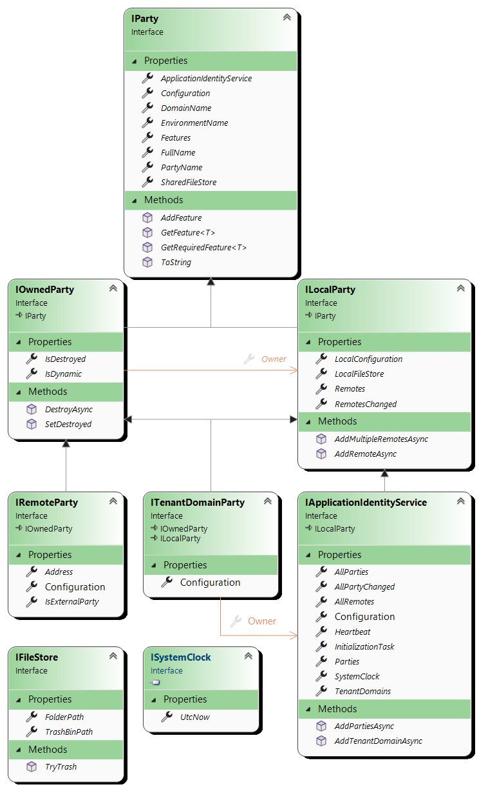

# Application identity model

This 'running" model is built from the immutable `ApplicationIdentityServiceConfiguration` 
(you should first read the [Application identity model configuration](../Configuration/README.md)
documentation before this one).

The resulting `IApplicationIdentityService` obtained is a "nearly" immutable object: configured Parties
are immutable but this can be extended by "dynamic parties". These dynamic parties are then also
immutable and, in the case of a `ITenantDomainParty` can also be extended by dynamic `IRemoteParty`. 

## The model

This model is "totally typed", there is no need for any property to be cast into a more precise
type (this is why the 3 fundamental objects that are `IRemoteParty`, `ITenantDomainParty`
and `IApplicationIdentityService` all expose their respective `RemotePartyConfiguration`,
`TenantDomainPartyConfiguration` and `ApplicationIdentityServiceConfiguration` Configuration property.

The implementation is totally thread safe. A micro agent (the [`AppIdentityAgent`](../AppIdentityAgent.cs))
handles the initialization, dynamic parties lifetime, setup and teardown of the features, and disposal
of the whole identity service.

__Note:__ The abstract base [`MicroAgent`](../MicroAgent.cs)] is publicly exposed as it can be reused
by (complex) feature implementations if needed.

## The FileStore

An [`IFileStore`](IFileStore.cs) is simply a local directory in the file system. The file's physical path
is exposed (it's simple and transparent): Features can use basic file and directory management APIs to
exploit them.

These directories are automatically created and made available and are machine-dependent: by default, they are in the
[Environment.SpecialFolder.LocalApplicationData](https://stackoverflow.com/a/9709394/190380)/CK-AppIdentity folder:
-	Sur Windows : C:\Users\username\AppData\Local\CK-AppIdentity
-	Sur Linux: /home/username/.local/share/CK-AppIdentity
 
This means that these directories are, in effect, shared by different applications using CK-AppIdentity on the same machine...
And this is perfectly deliberate! It may seem surprising, but this choice allows :

- Unify (at last!) application working directories. Whether it's a Web application, a console or something else,
  the "ACMELogistics/EN/$Portal" Party is necessarily unique (in the logical sense, not necessarily at all times, given
  application recycling and other artifacts). It doesn't matter how it's positioned on the file system: host (exe) applications
  can be moved freely.
- The ability to move Tenants between different hosts, whether they're on the same machine or transferred to another host: all
  application data for a local Tenant must be stored in its LocalFileStrore.

This requires applications using CK-AppIdentity to use this directory as the root of all their "application data".

Each Party has a **SharedFileStore** which is accessible to all Parties running on the same machine. RemoteParty are Parties:
their SharedFileStore is a cache that is used to manage information related to that Remote (independently of any local Party).
Typically, this is where you'll find a Remote's public keys.

If different local applications (different processes) interact with the same remote, then the work of obtaining public keys
will be "mutualized": this directory is a cache that **can be updated by any of the local applications** as they interact with it.

Each LocalParty exposes a **LocalFileStrore**: this space is dedicated to information that is (and should be) of interest only to
the local Party. 

In theory, it doesn't matter how these directories are structured on the file system (hash codes could be used, for example).
However, we believe that these stores should be easy to understand. In practice, we have decided that the environment ("#Dev",
"#Prod", etc.) should form the first level. Then, naturally, we exploit the Domain and its potentially hierarchical path, followed
by the $PartyName: this directory is the **SharedFileStore**.

The **LocalFileStore** is inside the **SharedFileStore** of the Party: it is the "*-Local*" folder. This results in a rather readable structure.
Here's a very simple example (from a unit test, which explains why we're not in %LOCALAPPDATA%) with two Parties in the same "Test" domain.

The presence of "-Local" in the 2 Party directories indicates that they both run on the same machine. The ".public" file is the
public key of the Party "$Listener" (this comes from the CK.AppIdentity.KeyManagement feature).

## And here come the Features...

These objects don't do more by themselves than being what they are. This can be seen as a "configurable
structure" on which the "Features" come into play. Features can decorate any of these objects and carries
the actual functionalities like managing the Key store of a Remote party, exposing the Google API of
a Google external Remote, etc.

Features are described [here](../Features/README.md).

